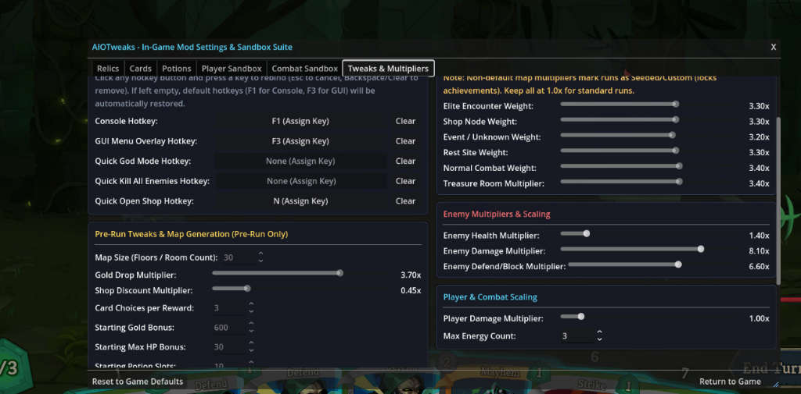
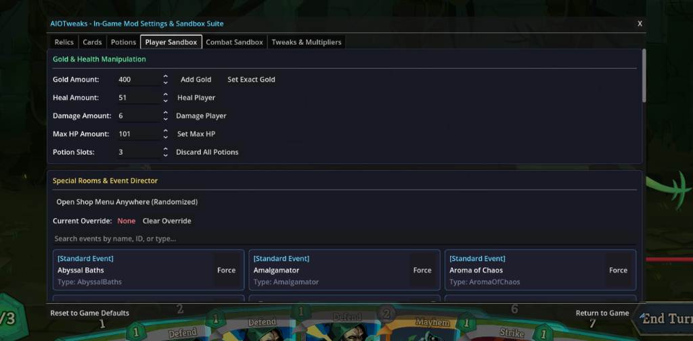
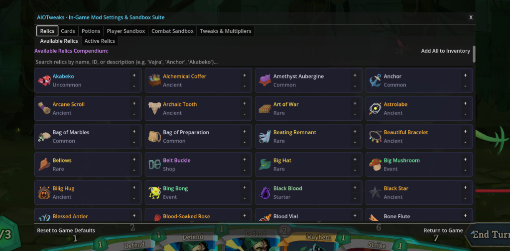
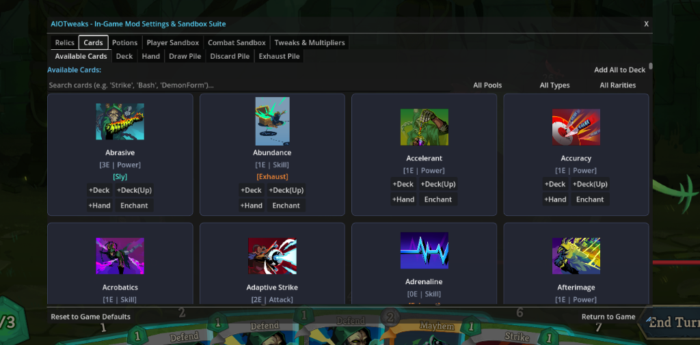
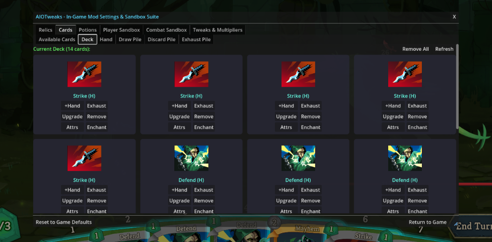
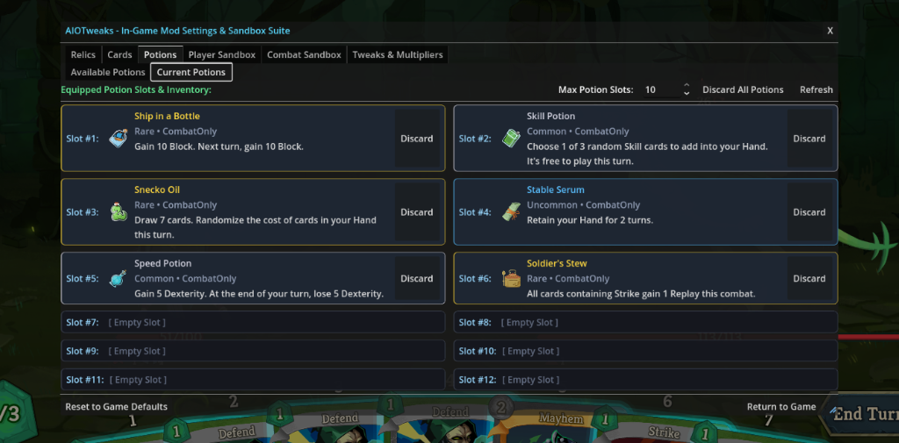

```text
    ___    ____ ____  ______                    __        
   /   |  /  _// __ \/_  __/      _____  ____ _/ /_______ 
  / /| |  / / / / / / / / | | /| / / _ \/ __ `/ //_/ ___/ 
 / ___ |_/ / / /_/ / / /  | |/ |/ /  __/ /_/ / ,< (__  )  
/_/  |_/___/ \____/ /_/   |__/|__/\___/\__,_/_/|_/____/   
                                                          
           Slay the Spire 2 Mod & Sandbox Suite
```

[](https://store.steampowered.com/app/2868840/Slay_the_Spire_2/)
[](https://godotengine.org/)
[](https://dotnet.microsoft.com/)
[](https://github.com/BepInEx/HarmonyX)
[](https://opensource.org/licenses/MIT)

**AIOTweaks** is an all-in-one suite of cheats, quality-of-life tweaks, and sandbox tools for **Slay the Spire 2**. Whether you want to test wild card combos, stack duplicate relics, push your deck to its limits with OP builds, craft custom challenges, embark on endless loop runs, or whatever your imagination comes up with, AIOTweaks puts complete control at your fingertips via an in-game GUI overlay.

---

## Screenshots

<p align="center">
  
  
</p>
<p align="center">
  
  
</p>
<p align="center">
  
  
</p>

---

## Table of Contents
- [Screenshots](#screenshots)
- [Features](#features)
- [Keybindings & Controls](#keybindings--controls)
- [Console Commands](#console-commands)
- [Project Architecture](#project-architecture)
- [Required Dependencies](#required-dependencies)
- [Building from Source](#building-from-source)
- [Installation Guide](#installation-guide)
- [Configuration](#configuration)
- [Troubleshooting](#troubleshooting)
- [License](#license)

---

## Features

### In-Game GUI Overlay (`F3`)
- **Draggable & Resizable Window**: Freely movable panel with coordinate persistence across game restarts and quick layout reset.
- **Interactive Hotkey Rebinding**: Click to reassign any hotkey directly inside the UI.
- **Run-Lock Protection**: Pre-run options (map room count, starting gold/HP, node weights) lock automatically during active runs to prevent map corruption.

### Pre-Run Tweaks & Modifiers
- **Run Modifiers**: Adjust gold rewards, shop discounts, draft pool sizes, starting gold/max HP, and force Neow encounters.
- **Combat Multipliers**: Independent sliders for player damage, enemy health, enemy damage, and enemy defend/block.
- **Max Energy & Potion Slots**: Configure baseline energy and scale maximum potion slots from 1 to 10 with automatic top-bar layout anti-overlap shifting.
- **Allow Multiple Relics**: Option to keep collected relics in loot pools for multi-relic stacking builds.
- **Endless Mode**: Compounding loop scaling for enemies over infinite run loops.
- **Custom Map Generation**: Adjust floor length (15–50 rooms), customize node distribution weights, or toggle Free Navigation ("Flying Boots") to visit any room freely.

### Card & Deck Director
- **Live Pile Views**: Inspect Master Deck, Hand, Draw Pile, Discard Pile, and Exhaust Pile with live counters and search filters.
- **Runtime Modification**: Add, remove, upgrade, downgrade, or force-exhaust cards instantly.
- **Keyword & Attribute Editor**: Toggle card keywords (Ethereal, Exhaust, Innate, Retain, Unplayable, etc.) at runtime.
- **Enchantments**: Apply or clear card enchantments with custom scalar amounts.

### Relics, Potions & Events
- **Relic Compendium**: Search, equip, stack, and remove any relic in the game.
- **Potion Manager**: Compendium browser to grant potions, plus active slot controls to drink or discard.
- **Event Forcing**: Force events anywhere, anytime.
- **Merchant Anywhere**: Open a randomized shop interface mid-run via hotkey (`quickOpenShopKey`), menu button, or console command (`shop`).

### Combat Sandbox & Status Effects
- **Instant Toggles**: God mode, infinite energy, one-hit kill, clear all enemies, and turn end overrides.
- **Status Effects Manager**: Browse and apply buffs/debuffs (Strength, Dexterity, Vulnerable, Weak, Poison, Artifact, etc.) to player or active monsters with arbitrary stack counts.

### Debug Console (`F1`)
- Overlay command-line terminal with command history, quick-action toggle buttons, and real-time color-coded event logging.

---

## Keybindings & Controls

| Action | Config Key | Default Hotkey | Notes |
| :--- | :--- | :--- | :--- |
| Toggle AIOTweaks Debug Console | `consoleHotkey` | `F1` | Interactive terminal overlay |
| Toggle Tabbed Mod Settings & Sandbox GUI | `guiOverlayHotkey` | `F3` | Draggable & resizable settings dialog |
| Quick Toggle God Mode (Invulnerability) | `quickGodModeKey` | *Unassigned* | Instant combat god mode toggle |
| Quick Kill All Active Enemies | `quickKillEnemiesKey` | *Unassigned* | Defeats all active enemies with death animations |
| Quick Open Shop Anywhere | `quickOpenShopKey` | *Unassigned* | Opens randomized shop overlay mid-run |

> [!TIP]
> Hotkeys can be interactively assigned in the **Mod Settings Dialog** (`Tweaks & Multipliers` tab), configured in `config.json`, or via BaseLib mod config menu. Default hotkeys (`F1` and `F3`) are automatically restored if left blank.

---

## Console Commands

Open the console with your configured keybind (`F1`) and execute any of the following commands:

| Command | Syntax / Example | Description |
| :--- | :--- | :--- |
| `help` | `help` | Lists all registered console commands with syntax. |
| `god` | `god` | Toggles God Mode (player becomes immune to all incoming damage). |
| `infenergy` | `infenergy` | Toggles Infinite Energy in combat. |
| `onehitkill` / `ohk` | `ohk` | Toggles One-Hit Kill (all player attacks deal fatal damage). |
| `killall` | `killall` | Instantly defeats all active enemies in combat. |
| `endturn` | `endturn` | Instantly forces the player's turn to conclude. |
| `gold` | `gold 500` | Adds the specified amount of gold to player inventory. |
| `setgold` | `setgold 999` | Sets player gold to an exact value. |
| `heal` | `heal 50` | Restores the specified amount of HP. |
| `damage` / `dmg` | `damage 20` | Deals direct damage to the player. |
| `setmaxhp` | `setmaxhp 120` | Modifies the player's maximum HP. |
| `relic` | `relic BurningBlood` | Adds a relic to the player by ID or class name. |
| `rmrelic` | `rmrelic BurningBlood` | Removes an active relic from the player. |
| `card` | `card Strike_R true` | Adds a card to the master deck (optional `true`/`false` for upgraded). |
| `handcard` | `handcard Defend_R` | Spawns a card directly into current combat hand. |
| `rmcard` | `rmcard Strike_R` | Removes a card instance from master deck. |
| `upcard` | `upcard Strike_R` | Toggles upgrade status of a card in master deck. |
| `exhaust` | `exhaust Strike_R` | Exhausts a card from current hand/deck to exhaust pile. |
| `enchant` | `enchant Strike_R Swift 2` | Applies an enchantment with specified amount/multiplier. |
| `disenchant` | `disenchant Strike_R` | Clears all enchantments from specified card. |
| `attr` / `keyword` | `attr Strike_R Ethereal add` | Adds, removes, or toggles card keyword attributes. |
| `event` | `event BigFish` | Forces the next rolled unknown room to be a specific event ID. |
| `clearevent` | `clearevent` | Clears active forced event overrides. |
| `shop` / `openshop` | `shop` | Opens a randomized merchant shop overlay anywhere. |
| `draw` | `draw 3` | Immediately draws specified number of cards in combat. |
| `energy` | `energy 2` | Adds specified energy points in combat. |
| `maxenergy` | `maxenergy 5` | Sets or displays the baseline Max Energy count. |
| `playerdmg` / `dmgmult` | `playerdmg 2.5` | Sets or displays the player damage multiplier. |
| `verbose` / `debuglog` | `verbose on` | Toggles verbose diagnostic logging. |
| `clear` | `clear` | Clears text from the console log window. |
| `reset` | `reset` | Clears all transient cheats and resets state to default. |

---

## Project Architecture

```text
AiOTweaks_StS2/
├── aiotweaks.sln                # .NET Solution file
├── AIOTweaks.json               # Slay the Spire 2 Mod Manifest
├── build.sh                     # Automated Linux build & assembly discovery script
├── README.md                    # Documentation & user guide
├── AGENTS.md                    # Architecture guidelines & agent rules
├── config/
│   └── default_config.json      # Default schema and fallback reference
├── assets/
│   └── icons/                   # UI texture icons & assets
│       └── README.md
└── src/
    ├── AIOTweaks.csproj         # C# project targeting net9.0 + Godot Mono
    ├── Core/
    │   ├── ModEntry.cs          # Mod lifecycle entry point & scene injector
    │   ├── GameHelper.cs        # Reflection, card/relic query & engine utilities
    │   ├── Logging/
    │   │   └── ModLogger.cs     # Centralized [AIOTweaks] logging & file diagnostics
    │   ├── Config/              # Strongly typed JSON config & profile manager
    │   │   ├── ModConfig.cs     # Configuration schema definitions
    │   │   ├── RunSettings.cs   # Run profile settings schema
    │   │   ├── ConfigManager.cs # Config file persistence & fallback loader
    │   │   └── AIOTweaksBaseLibConfig.cs # BaseLib ModConfigRegistry provider
    │   └── State/
    │       └── RuntimeStateManager.cs # Transient cheat tracking & lifecycle resets
    ├── Hooks/                   # Harmony patching modules
    │   ├── CombatHooks.cs       # Invulnerability, energy, damage, def & draw hooks
    │   ├── EconomyHooks.cs      # Gold reward & shop price patches
    │   ├── EventHooks.cs        # Event manipulation & forcing
    │   ├── MapGenerationHooks.cs# Map weights, room length, free navigation, Neow & Ancient fallbacks
    │   ├── ModdingScreenHooks.cs# Modding screen, Mod Info container & Character select button injections
    │   └── RelicHooks.cs        # Allow Multiple Relics & TopBar anti-overlap layout patches
    ├── Cheats/                  # Domain-specific cheat managers
    │   ├── CardDirector.cs      # Deck, hand, pile, attribute & enchantment spawning
    │   ├── CombatDirector.cs    # Combat sandbox & turn management
    │   ├── EventDirector.cs     # Event routing and queue forcing
    │   ├── InventoryDirector.cs # Currency and HP operations
    │   ├── PotionDirector.cs    # Atomic potion grant/discard and slot management
    │   ├── RelicDirector.cs     # Atomic relic injection/removal
    │   └── StatusDirector.cs    # Real-time player and enemy power/status effects
    └── UI/                      # Godot scene overlays and controls
        ├── UIHelper.cs          # SpinBox numeric validation & UI helper extensions
        ├── Menu/
        │   ├── ModSettingsDialog.cs   # Draggable/resizable Tabbed Mod Settings Dialog
        │   ├── ModSettingsDialog.tscn
        │   ├── PreRunSettingsMenu.cs  # Character select pre-run tweaks panel
        │   └── PreRunSettingsMenu.tscn
        └── Overlay/
            ├── DebugConsole.cs  # In-run CanvasLayer Debug Console
            └── DebugConsole.tscn
```

---

## Required Dependencies

- **[.NET 9.0 SDK](https://dotnet.microsoft.com/download/dotnet/9.0)** (or later)
- **[Godot Engine 4.3+ (.NET / Mono Build)](https://godotengine.org/download)**
- **Slay the Spire 2** (Installed via Steam)
- NuGet packages (resolved automatically at compile-time):
  - `Lib.Harmony` (>= 2.3.3)

---

## Building from Source

### Quick Build (Linux / Steam Deck)
Run the root build script, which automatically detects your .NET SDK, locates Steam game assemblies across standard directories, compiles the binary, and displays the output location:

```bash
# Compile Release build (default)
./build.sh

# Compile Debug build (forcefully enables verbose logging and writes to aiotweaks_debug.log in mod root)
./build.sh debug
```

### Manual Build
1. Clone or open the repository:
   ```bash
   git clone https://github.com/yschirelli/AiOTweaks_StS2.git
   cd AiOTweaks_StS2
   ```

2. Restore dependencies and compile the binary:
   ```bash
   # Release build
   dotnet restore aiotweaks.sln
   dotnet build aiotweaks.sln -c Release

   # Debug build (with forced verbose logging and file logger)
   dotnet build aiotweaks.sln -c Debug
   ```

3. The compiled assembly and manifest will be output to:
   ```text
   src/.godot/mono/temp/bin/Release/  (or bin/Debug/)
   ├── AIOTweaks.dll
   ├── AIOTweaks.pdb
   └── AIOTweaks.json
   ```

> [!NOTE]
> **Debug Builds**: When built in `Debug` configuration, verbose logging is forcefully enabled by default regardless of config file settings, and all real-time diagnostics are written to `aiotweaks_debug.log` directly in the mod's root folder.

---

## Installation Guide

1. Obtain or build `AIOTweaks.dll` and `AIOTweaks.json`.
2. Locate your Slay the Spire 2 `mods` folder (create it in the game root if it does not exist):
   - **Windows:** `C:\Program Files (x86)\Steam\steamapps\common\Slay the Spire 2\mods\AIOTweaks\`
   - **Linux / Steam Deck:** `~/.local/share/Steam/steamapps/common/Slay the Spire 2/mods/AIOTweaks/`
3. Copy `AIOTweaks.dll` and `AIOTweaks.json` into the `mods/AIOTweaks/` directory.
4. Launch the game.

---

## Configuration

Settings persist directly inside the mod root directory (`mods/AIOTweaks/config.json`) so your preferences and window layouts persist across sessions:

```json
{
  "general": {
    "enabled": true,
    "debugLogging": false,
    "consoleHotkey": "F1",
    "guiOverlayHotkey": "F3",
    "quickGodModeKey": "",
    "quickKillEnemiesKey": "",
    "quickOpenShopKey": ""
  },
  "preRunTweaks": {
    "goldRewardMultiplier": 1.0,
    "shopDiscountMultiplier": 1.0,
    "cardRewardCount": 3,
    "startingGoldBonus": 0,
    "startingMaxHpBonus": 0,
    "forceNeowBonus": true,
    "mapRoomCount": 15,
    "playerDamageMultiplier": 1.0,
    "maxEnergy": 3,
    "enemyHealthMultiplier": 1.0,
    "enemyDamageMultiplier": 1.0,
    "enemyDefendMultiplier": 1.0,
    "allowMultipleRelics": false,
    "potionSlots": 3,
    "freeMapNavigation": false,
    "endlessMode": {
      "enabled": false,
      "enemyScalingMultiplier": 2.0
    },
    "mapNodeDistribution": {
      "eliteWeightMultiplier": 1.0,
      "shopWeightMultiplier": 1.0,
      "eventWeightMultiplier": 1.0,
      "restSiteWeightMultiplier": 1.0,
      "combatWeightMultiplier": 1.0,
      "treasureRoomMultiplier": 1.0
    }
  },
  "combatSandbox": {
    "godMode": false,
    "infiniteEnergy": false,
    "oneHitKill": false,
    "bonusDrawPerTurn": 0,
    "maxHandSizeOverride": 10,
    "infinitePotions": false,
    "noCardExhaust": false
  },
  "ui": {
    "overlayScale": 1.0,
    "overlayOpacity": 0.95,
    "showDebugConsoleOnStart": false,
    "enableAudioCues": true,
    "menuPosX": null,
    "menuPosY": null,
    "menuWidth": null,
    "menuHeight": null
  }
}
```

---

## Troubleshooting

- **Opening Mod Settings or Console:** Press `F3` for Mod Settings or `F1` for Debug Console. You can also access settings directly from the in-game **Mods** menu, **Character Select** screen, or customize keybindings in `config.json`.
- **Mod not showing up in Mods list:** Verify `AIOTweaks.json` is located directly in `mods/AIOTweaks/AIOTweaks.json` alongside `AIOTweaks.dll`.
- **Resetting Window Size / Layout:** If the settings dialog was resized or moved off-screen, click the "Reset to Game Defaults" button inside the dialog or delete the `menuPosX`/`menuPosY`/`menuWidth`/`menuHeight` keys in `config.json`.
- **Build error with missing Godot assemblies:** Ensure the Godot .NET SDK / targeting packs are installed and the .NET 9 SDK is active (`dotnet --version`).

---

## License

This project is licensed under the [MIT License](LICENSE).
